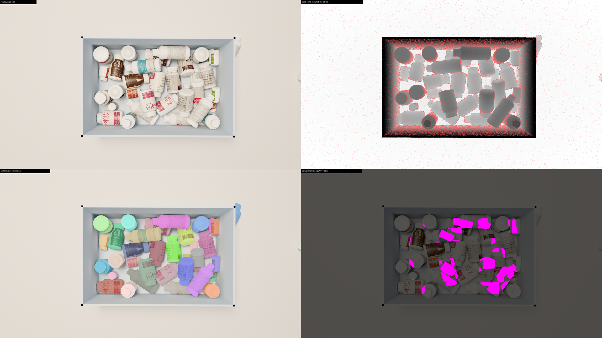
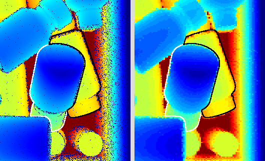

# Pharma-Bin-Picking Synthetic Benchmark

A synthetic dataset for evaluating **suction-cup grasp prediction algorithms** on cluttered piles of Korean pharmaceutical bottles. Each scene provides RGB + depth + amodal segmentation + per-bottle 6-DOF pose + analytical suction-grasp ground truth in a single self-describing JSON, mimicking the real Intel RealSense L515 capture rig (1920×1080 top-down view, 1.286 m above the workspace).

This is a **benchmark**, not training data. Algorithms are evaluated by the AP_μ metric (SuctionNet convention) — we do not advise training on this dataset directly without a held-out split.

---

## Sample (v1.1 batch, scene_000005)

A rendered scene and its ground truth — RGB, L515-noise depth, per-instance visible masks, and the occlusion (hidden) regions:



Bottles are mostly white HDPE; colour comes from the label, which wraps a body band only (cap, base, and back of the bottle are bare plastic, like real pharmacy bottles). Depth carries simulated L515 sensor noise — the red specks are dropout pixels (no return). 7 bottle classes, ~35 visible instances per scene, ~49 bottles dropped (escapees and fully-buried ones don't all end up visible).

A fuller set of GT visualisations (occlusion-bucket colouring, labelled bounding boxes, a 1-pixel-visible buried instance) is generated by `scripts/viz/render_bottle_previews.py` and the GT-overlay snippets in `scripts/viz/`.

### Known limitation: white-on-white separation

The one named gap in segmentation performance on this benchmark is **plain white bottles next to other plain white bottles** (blue_cap_pill_bottle, white_pill_bottle, pill_jar — the featureless white classes drop to 0.50–0.57 recall while the colourful syrups stay 0.83–0.92). A 2026-05-12 diagnostic confirmed this is a **model-side** limitation, not a depth-preprocessing artifact — the inter-bottle depth gradient survives the pipeline cleanly and is just as strong as on bottles UOAIS-Net successfully separates. The model underweights depth when RGB contrast is low.



*Left: raw depth, tight colormap. Right: depth after the inference pipeline's normalize → resize → inpaint. The white-outlined pill_jar is clearly distinct in both — yet UOAIS missed it.* Full diagnostic + the other two figures in [`docs/eval/eval_methodology.md`](docs/eval/eval_methodology.md).

---

## What's in each scene

```
output/scene_NNNNNN/
├── rgb/0000.png              # 1920×1080 sRGB (Cycles, 64 spp)
├── depth/0000.png            # uint16 PNG, millimeters
├── visible_masks/*.png       # per-instance, 0/255 — what the camera actually sees
├── amodal_masks/*.png        # per-instance, full silhouette including occluded parts
├── occlusion_masks/*.png     # amodal AND NOT visible — the hidden region
└── scene_gt.json             # all annotations + metadata (see schema below)
```

**Per scene:** ~34 visible instances drawn from 7 bottle classes, ~36% with ≥10% occlusion (skewed toward the easier end but with non-trivial 30–80% occluded examples in every batch).

---

## scene_gt.json schema

```jsonc
{
  "image_id":     0,
  "rgb":          "rgb/0000.png",
  "depth":        "depth/0000.png",
  "depth_unit":   "mm",
  "width":        1920,
  "height":       1080,
  "camera_K":     [[fx, 0, cx], [0, fy, cy], [0, 0, 1]],

  "suction_meta": {
    "version":              "v1.5",
    "cup_radius_mm":        15.0,
    "r_safety_mm":          5.0,                         // V1.5: cup must be at least r+r_safety from mask boundary
    "nms_dist_mm":          5.0,                         // V1.5: top-K spatially-diverse, min spacing
    "plane_fit_dense":      true,                        // V1.5: plane fit on dense disc pixels, not sparse cloud
    "mu_default":           0.5,
    "mu_sweep":             [0.2, 0.4, 0.6, 0.8, 1.0, 1.2],
    "tau_seal":             0.5,
    "tau_wrench":           0.5,
    "match_tolerance_mm":   5.0,
    "object_mass_kg":       0.1,
    "atmospheric_pressure_Pa": 101325.0,
    "n_candidates_per_instance": 200,
    "top_k_per_instance":   50,
    "filters_applied":      ["edge_clearance", "normal_alignment", "visibility", "collision_free"],
    "scoring":              "Sseal: exp(-residual_mm/sigma_seal_mm); Swrench: exp(-F_lat/(mu*F_vac))*exp(-tau_arm_mm/cup_radius_mm)",
    "references": [
      "Mahler et al. 2018, Dex-Net 3.0, arXiv:1709.06670",
      "Cao et al. 2021, SuctionNet-1Billion, arXiv:2103.12311",
      "Li & Cappelleri 2023, Sim-Suction, arXiv:2305.16378"
    ]
  },

  "instances": [
    {
      "instance_id":     8,
      "class_name":      "pill_jar",             // one of the 7 IDs (see classes table)
      "category_id":     1,                       // integer class index
      "visible_mask":    "visible_masks/0000_0008.png",
      "amodal_mask":     "amodal_masks/0000_0008.png",
      "occlusion_mask":  "occlusion_masks/0000_0008.png",
      "visible_px":      16688,
      "amodal_px":       17240,
      "occlusion_rate":  0.032,                   // (amodal_px - visible_px) / amodal_px
      "bbox_xywh_amodal": [107, 723, 184, 161],   // image-space bbox, x,y,w,h

      "pose_cam": {                               // 6-DOF pose, OpenCV cam frame
        "R":               [[...], [...], [...]],  // 3x3, orthogonal, det=+1
        "t":               [tx, ty, tz],            // meters
        "object_up_axis":  [0, 0, 1],               // bottle's local +Z is up
        "object_frame_unit": "mm",                  // OBJ vertex coords are in mm
        "bbox_3d_mm":      [w, d, h]                // bottle's physical dimensions
      },

      "suction_points": [                         // top-50, sorted by S_combined desc
        {
          "point_3d_cam":         [0.012, -0.045, 0.834],   // m, OpenCV cam frame
          "point_2d_px":          [712, 423],
          "normal_cam":           [0.02, 0.05, -0.998],     // unit, points toward camera
          "Sseal":                0.91,
          "Swrench_default":      0.78,                       // computed at mu=mu_default
          "S_combined_default":   0.71,                       // = Sseal * Swrench_default
          "lateral_force_N":      0.42,                       // m·g·sin(theta)
          "normal_force_N":       0.96,                       // m·g·cos(theta)
          "vacuum_force_N":       71.4,                       // P_atm · pi · r²
          "torque_arm_mm":        4.1,
          "flatness_residual_mm": 0.42,
          "normal_angle_deg":     5.7,
          "tilt_deg":             3.2
        }
        // ... up to 50 entries
      ]
    }
    // ... ~34 instances per scene
  ]
}
```

**Coordinate frame: OpenCV.** Camera +X right, +Y down image, +Z into the scene. All 3D quantities (`point_3d_cam`, `pose_cam.t`, `normal_cam`) use this frame consistently. Translations are in **meters**; the `*_mm` suffix marks fields explicitly in millimeters (depth image, torque_arm, flatness_residual, bbox_3d).

---

## Bottle classes (v0.2)

| `class_name` (id) | Korean name | Photoreal label? | Source |
|---|---|---|---|
| `kolmin_a_syrup` | 콜민A시럽 | ✅ yes | Capture team 2026-04-29 |
| `levozin_syrup` | 레보진시럽 | ✅ yes | Capture team 2026-04-29 |
| `blue_cap_pill_bottle` | 파란뚜껑 약통 | procedural | Capture team 2026-04-22 |
| `white_pill_bottle` | 하얀 약통 | procedural | Capture team 2026-04-22 |
| `pill_jar` | 의약품 병 (squat) | procedural | Capture team 2026-05-03 |
| `medicine_bottle_a` | 의약품 병 A | procedural | Capture team 2026-05-03 |
| `medicine_bottle_b` | 의약품 병 B | procedural | Capture team 2026-05-03 |

Photoreal labels (kolmin, levozin) use UV-mapped real-product photographs. Procedural-label bottles draw from a pool of **35 PNGs on disk** in `textures/labels/`: 30 ChatGPT-generated realistic Korean pharmacy labels (`label_048..077_chatgpt_*.png` — syrups, tablets, capsules, powders, injection ampoules; varied colors and layouts) + 2 photoreal Korean labels + 3 `*fullcolor*.png` template files. **32 are active at runtime** — `load_label_pool()` excludes the 3 `*fullcolor*` templates. Each procedural bottle gets one random label from the pool per scene, applied to a body band only (UV V ∈ [0.10, 0.80], U ∈ [0.15, 0.85]) so the cap, base, and back of the bottle show bare white HDPE — matching real pharmacy bottles. Off-domain labels (1 craft-beer template + 5 Western pharma-graphic banners) are quarantined in `textures/labels_distractors/` and not loaded. Algorithms must not assume label content (text, color); only geometry. *(v1.1, 2026-05-12 — replaced the earlier 37 fake-Korean-text procedural labels.)*

---

## Coverage stats (5-scene reference batch, 2026-05-06)

| Metric | Value |
|---|---|
| Visible instances per scene | mean 35.2 (range 34–38) |
| Instances inside tray | 95% |
| Class balance | 23–28 per class (very even) |
| Mean occlusion rate | 0.168 |
| Instances ≥10% occluded | 36% |
| Instances 30–80% occluded | 20% |
| Suction points per instance | mean 22.4 (capped at 50) |
| Instances with ≥1 grasp point | 92% |

A larger batch will be released as `v0.2-100scenes`. These numbers are the per-batch expectation an evaluator should see.

---

## Evaluation protocol (AP_μ)

This is the dataset's **primary** evaluation — it scores **suction-grasp prediction** algorithms (the task the dataset exists for), following the SuctionNet convention. It is a written spec: there is no `eval_apmu.py` yet, because no grasp algorithm has been run against the benchmark — the protocol below defines the rules for when one is. *(For a separate, secondary check — how well an instance-segmentation model finds and segments the bottles — see [`docs/eval/eval_methodology.md`](docs/eval/eval_methodology.md); that one is implemented as `scripts/eval/eval_uoais_on_synth.py` and is about perception, not grasping.)*

For each scene, an algorithm submits a list of predicted suction grasps:
```python
[(point_3d_cam, normal_cam, predicted_score), ...]
```
sorted by `predicted_score` descending. The evaluator truncates to top-50 per scene.

**Step 1 — Match each prediction to a GT point.**
Closest GT point on the **same instance** within `match_tolerance_mm` (5 mm). Predictions outside any GT zone are unmatched → counted incorrect.

**Step 2 — Decide correctness at friction μ.**
A matched prediction is correct iff:
```
Sseal(matched_gt) ≥ tau_seal    AND    Swrench(matched_gt, μ) ≥ tau_wrench
```
where `Swrench(μ)` is recomputed from the GT's μ-independent physical quantities:
```
F_lat_max(μ) = μ · vacuum_force_N
Swrench(μ)   = exp(-lateral_force_N / F_lat_max(μ)) · exp(-torque_arm_mm / cup_radius_mm)
```

**Step 3 — Compute `Precision@k` for k = 1..50, average to AP_μ.**

**Step 4 — Average AP_μ across the friction sweep μ ∈ {0.2, 0.4, 0.6, 0.8, 1.0, 1.2} → final `AP`.**

**Recommended secondary reports:**
- `AP_per_class` (per the 7 bottle classes — discriminates difficulty by shape)
- `AP_per_occlusion_bin` (0–10%, 10–30%, 30–50%, 50–80% — discriminates difficulty by clutter)
- `AP_per_friction` (the AP_μ sweep — discriminates by friction assumption)

---

## Generating scenes

### Single scene
```bash
blenderproc run scripts/generate_scene.py --config scripts/config.yaml --scene-id 1
```

### Batch
```bash
bash scripts/run_batch.sh 50          # scenes 1..50
bash scripts/run_batch.sh 100 500     # scenes 500..599
```

Each scene runs in its own Blender process (BlenderProc requirement). Expect ~95 s per scene on an RTX A6000, of which ~70 s is the per-instance amodal mask render pass, ~20 s is RGB Cycles render, and ~1.3 s is suction GT computation.

### Quality checks
```bash
python scripts/eval/dataset_qc.py --output-dir output
```
Validates 14 integrity invariants (8 suction GT + 6 pose + mask containment) plus reports class balance, occlusion histogram, and score distributions. A clean run shows **all zeros** in the integrity sections.

### Visualizing suction GT overlay
```bash
python scripts/viz/viz_suction.py --scene output/scene_000001 --top 5 --cup-radius
```
Saves `suction_overlay.png` next to the rgb image — green dots = high quality, red = low.

---

## Configuration (`scripts/config.yaml`)

| Section | Key | Default | Effect |
|---|---|---|---|
| `meshes` | `copies_per_mesh` | 7 | total bottles per scene = 7 × this |
| `tray` | `inner_w` / `inner_d` | 0.70 / 0.45 m | tray footprint |
| `tray` | `wall_h` | 0.30 m | tall enough to hold a 49-bottle pile |
| `drop` | `z_range` | [0.22, 0.30] m | drop height (lower = less bounce) |
| `camera` | `height_m` | 1.286 | matches L515 extrinsics |
| `camera` | `jitter_xy_m`, `jitter_rot_deg` | 0.02, 2.0 | slight per-scene variety |
| `lighting` | `n_lights`, `energy_range` | 3, [40, 120] | point lights |
| `render` | `samples` | 64 | Cycles samples — bump to 256 for final |
| `output` | `seed` | 42 | deterministic per-scene_id |

The defaults reflect the 2026-05-06 escape-rate fix; do not lower `wall_h` or raise `z_range` without re-checking the escape stats.

---

## Setup

Python 3.10 or 3.11 (not 3.12). Uses [uv](https://github.com/astral-sh/uv) for the venv.

```bash
uv venv .venv_synth --python 3.11
source .venv_synth/bin/activate
uv pip install blenderproc==2.8.0 numpy pillow opencv-python-headless pyyaml tqdm scipy

blenderproc quickstart    # one-time Blender download (~700 MB, cached to ~/blender/)
blenderproc --version     # should print 2.8.0
```

---

## Known limitations (honest disclosure)

Per the four-layer benchmark validation framework ([docs/](docs/)):

- **Layer 1 (annotation integrity)** — passes: 14 integrity invariants all clean on the reference batch.
- **Layer 2 (coverage)** — partially disclosed:
  - 7 bottle classes (vs SynTable 1075). Diversity is the main coverage gap.
  - Occlusion now spans the 0–80% range (was 0–10% pre-2026-05-06).
  - Pose-variety histograms not aggregated yet — raw R, t exported, computable downstream.
- **Layer 3 (predictive validity)** — **untested**. The decisive question — "do algorithm rankings on this dataset predict rankings on real captures?" — is blocked on real Intel L515 captures and ≥2 algorithm implementations. Until done, treat this as a curated dataset, not a validated benchmark.
- **Layer 4 (sim-to-real gap, e.g. SDQM/SEDD)** — not measured. Optional for benchmark use; would matter more if you trained on the data.

**Suction GT model is V1 (simplified analytical):**
- `Sseal` is a Gaussian on plane-fit residual (SuctionNet's residual reduced from full spring-mesh model)
- `Swrench` is a closed-form gravity wrench (Dex-Net 3.0 §III.C without the full QP solver)
- Adequate for benchmark ranking; a future V2 would swap in the spring-mesh seal + QP wrench. We do not expect rank-order changes from V1 → V2 on this dataset, but have not verified.

**Other notes:**
- Bottles occasionally escape the tray during physics (~5% per scene end up outside on the floor; their masks/poses are still valid). Do not use scenes' implicit "bottle count" as a quality signal — use `len(instances)`.
- Procedural labels are stock-design Korean-medicine-style PNGs, not photographs of real product labels (those exist only for `kolmin_a_syrup` and `levozin_syrup`). Domain match is therefore stronger for those two classes.

---

## Versions

This table is the dataset changelog. Each row is a logical milestone; rows marked **(git-tagged)** also exist as an annotated git tag — the rest are documented here only (tags were backfilled retroactively, see git history for the corresponding commit).

| Tag | State |
|---|---|
| `v0.1.0-no-textures` **(git-tagged)** | End-to-end pipeline, 4 classes, procedural materials. Segmentation only. |
| `v0.2-suction+pose` **(git-tagged)** | 7 classes, 2 photoreal labels, suction-point GT V1, 6-DOF pose, escape fix. |
| `v0.2.5-suction-v1.5` **(git-tagged)** | Suction GT upgraded: dense plane fit, margin-aware edge clearance, NMS top-K. |
| `v0.3-depth-l515` | L515-specific depth noise model (v2-l515): axial polynomial fitted to Berlin 2021 <0.5 mm bound, specular/dark/grazing dropouts, 5 mm radial bias, 0.25 mm quantization (storage switched to L515 native depth units). Lighting variety via CCT randomization 2500–6500 K. |
| `v0.4-p1-shipped` **(git-tagged)** | P1 30-scene re-render shipped (`output/h_1.286/scene_000001..000030`, 1051 instances). Class-imbalance bug fixed (was 2/5/3 for classes 5-7, now 133-164 across all 7). UOAIS eval: F1 0.828 / IoU 0.853 (prior 6-scene baseline was F1 0.893 / IoU 0.895 — realism work moved scores into published-synth norm range). Stock external labels added to procedural pool (47 PNGs on disk, 44 active after `*fullcolor*` filter; 1 off-domain panel quarantined). |
| `v1.0-final` (2026-05-11) **(git-tagged)** | Marked terminal for dev. No real L515 captures in development (production-only); Layer 3 predictive validity intentionally not pursued. All P-items closed (P0/P1/P2/P3 shipped, P4 deferred). UOAIS eval (30-scene batch): F1 0.828 / IoU 0.853. |
| `v1.1-realistic-labels` (2026-05-12) **(git-tagged)** | **Label pool overhaul + UV band fix.** Replaced 37 fake-Korean procedural labels with 30 ChatGPT-generated realistic Korean pharmacy labels (syrup/tablet/capsule/powder/injection, varied colors and layouts). Quarantined 5 off-domain external pharma-graphic labels to `textures/labels_distractors/`. Active pool now 32 (30 ChatGPT + 2 photoreal). `make_label_material`: added V band [0.10, 0.80] (cap + base show bare HDPE) and U band [0.15, 0.85] (back of bottle bare, hides UV seam) — bottles now look like real pharmacy products with white caps and a label band. **Current. Synth re-marked terminal at this version.** *Note (eval-only, dataset unchanged): on 2026-05-12 the UOAIS-on-synth eval protocol was overhauled — Hungarian visible-mask matching, F@.75 (Dice), occlusion-stratified recall, small-mask filter. The headline F1 moved 0.832→0.845 because of the protocol change, not the data — the v1.1 render is byte-identical. See [`docs/eval/eval_methodology.md`](docs/eval/eval_methodology.md) for the new numbers and the white-on-white failure finding.* |

---

## Layout

```
pharma-bin-picking-synth-dataset/
├── README.md                     # this file
├── docs/
│   ├── README.md                              # docs index
│   ├── synth_realism_improvement_plan.md      # canonical project history (TERMINAL v1.1)
│   ├── suction_gt/
│   │   ├── suction_gt_design.md               # design + literature review
│   │   ├── suction_gt_v1_implementation.md    # V1 scope, shipped 2026-05-04
│   │   └── suction_gt_v1_5_refinements.md     # V1.5 refinements, shipped 2026-05-06
│   ├── depth_noise/
│   │   ├── depth_noise_l515_design.md         # L515-specific noise model
│   │   └── depth_noise_reviewer_audit.md      # independent reviewer audit
│   ├── pose_export/
│   │   └── pose_export_design.md              # 6-DOF pose schema + frame conventions
│   ├── sample_data/
│   │   └── sample_data_naming_convention.md   # ASCII per-bottle layout
│   └── team/
│       └── team_workflow.md                   # synth-lead ↔ synth-dev process rules
├── scripts/
│   ├── config.yaml                    # all scene/render/camera knobs
│   ├── generate_scene.py              # main BlenderProc script
│   ├── run_batch.sh                   # batch runner
│   ├── depth_io.py                    # core: depth save/load
│   ├── depth_noise.py                 # core: L515-style noise model
│   ├── suction_gt.py                  # core: V1 suction GT module
│   ├── eval/                          # evaluation tools
│   │   ├── eval_uoais_on_synth.py     # UOAIS-vs-GT IoU/mAP scoring
│   │   └── dataset_qc.py              # 14 integrity checks + coverage report
│   ├── viz/                           # visualization tools
│   │   ├── viz_suction.py             # suction overlay visualizer
│   │   ├── visualize_classes.py       # class-label overlay
│   │   ├── render_bottle_previews.py  # per-bottle preview cropper
│   │   ├── record_drop_video.py       # physics-drop side-view video
│   │   └── viz_simsuction_grasps.py   # Sim-Suction grasp overlay
│   ├── convert/                       # format conversion
│   │   └── convert_scene_to_simsuction.py
│   └── archive/                       # obsolete scripts (kept for reference)
├── sample_data/bottles/               # 7 ASCII-named per-bottle folders
└── output/                            # generated scenes (gitignored)
```

---

## References

This benchmark adopts conventions from:

- Mahler et al. 2018, **Dex-Net 3.0**, arXiv:[1709.06670](https://arxiv.org/abs/1709.06670) — original analytical seal+wrench model
- Cao et al. 2021, **SuctionNet-1Billion**, arXiv:[2103.12311](https://arxiv.org/abs/2103.12311) — two-score continuous label format, AP_μ evaluation
- Li & Cappelleri 2023, **Sim-Suction**, arXiv:[2305.16378](https://arxiv.org/abs/2305.16378) — synthetic-data analog: 1.5 cm cup, 15% deformation defaults
- Hodaň et al. 2024, **BOP Challenge 2024**, arXiv:[2504.02812](https://arxiv.org/abs/2504.02812) — pose representation conventions

Citation for this dataset (placeholder until publication):
```bibtex
@misc{pharma_bin_picking_synth_2026,
  title  = {Pharma-Bin-Picking Synthetic Benchmark},
  author = {CBNU Picking-Arm Robot Project},
  year   = {2026},
  note   = {v1.1-realistic-labels}
}
```
